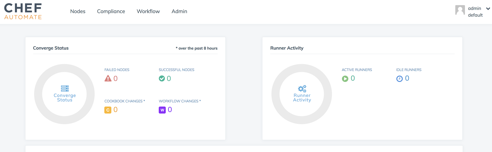
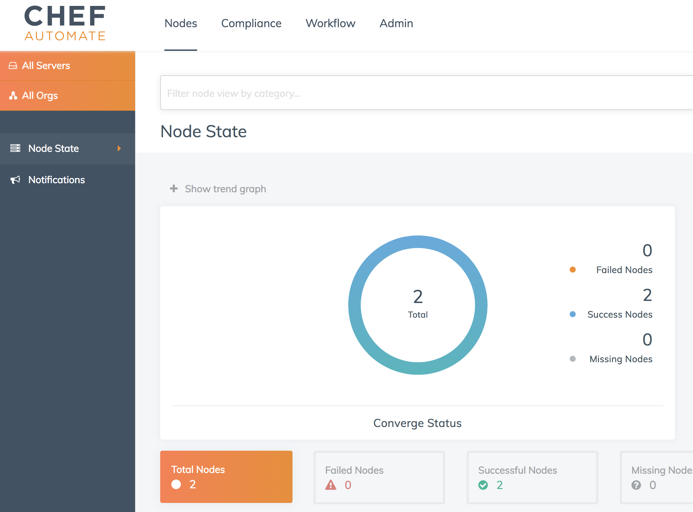
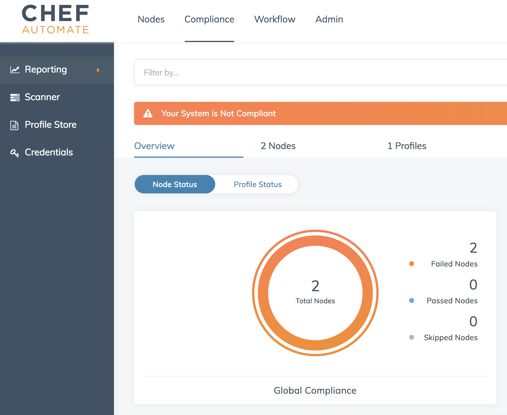

:toc:
= Compliance of Nodes in a Kubernetes Cluster using AWS OpsWorks for Chef Automate

This repo will explain how you can check for compliance of worker nodes in a Kubernetes cluster using https://aws.amazon.com/opsworks/[AWS OpsWorks for Chef Automate] (OWCA).

== Launch AWS OpsWorks for Chef Automate Server

. Launch a Chef server using OWCA: https://console.aws.amazon.com/opsworks/cm/home?owc=chefautomate&region=us-east-1#/chef/. Specify a name and take rest as the default values.
. Download Credentials and Starter Kit.
.. Expand the Starter Kit bundle, this is your Chef repo.
.. Credentials file is named `<owca-name>_credentials.csv`.
. From the AWS Console, select the Chef server and login to the OWCA Dashboard. Use the credentials downloaded earlier.
+

== Download and configure ChefDK

. Download and Install ChefDK from https://downloads.chef.io/chefdk
. Initialize a terminal:

  eval "$(chef shell-init bash)"

. In the Starter Kit directory, get SSL certificate from the Chef server by giving the following command:

  knife ssl fetch

. Verify install:

	$ knife client list
	default-validator

== Upload Chef Cookbooks

Upload Chef Client and Audit cookbook. Chef nodes, also the Kubernetes worker nodes, executes these cookbooks from the OWCA server based upon their checkin time.

. Download all dependencies:

  berks install

. Upload cookbooks and dependencies to the Chef server:

  berks upload

. By default, Apache 2 is included in the recipe uploaded to the Chef server. This is not required to be installed on the worker nodes. Remove `apache2` recipe from `<owca-server>-repo/roles/opsworks-example-role.rb`.
. Create role for the cookbooks execution:

  knife role from file roles/opsworks-example-role.rb

. In Chef UI, `Compliance`, `Profile Store`, `Available`, search for `DevSec SSH Baseline` profile and click on `Get`.
. In `<owca-server>-repo/site-cookbooks/opsworks-audit/attributes`, check this is the same profile that is defined.

== Create Kubernetes Cluster

. Install kops

  brew update && brew install kops

. Create an S3 bucket and setup `KOPS_STATE_STORE`:

  export KOPS_STATE_STORE=s3://kubernetes-aws-io
  aws s3 mb kops-config/$KOPS_STATE_STORE

. Create a k8s cluster:

  export NAME=chef.k8s.local
  kops create -f kops-config/$NAME.yaml

. Create the master instance group:

  kops create -f kops-config/master-eu-west-1a.yaml

. Update `kops-config/nodes.yaml` to replace `INSERT-YOUR-USERDATA-HERE` with the contents of `userdata.sh` from the Starter Kit. It allows the node to bootstrap with the OWCA server.
. Create the nodes instance group:

  kops create -f kops-config/nodes.yaml

. Create a secret pointing to the SSH key:

  kops create secret --name $NAME sshpublickey admin -i ~/.ssh/id_rsa.pub

. Launch the cluster:

  kops update cluster $NAME --yes

. Validate the cluster:

  kops validate cluster

. Optionally, login to EC2 instances:

  ssh -i my-chef-automate-repo/.chef/private.pem  admin@<public-ip>

== Show Kubernetes Nodes as Chef Nodes in OWCA Server

. Open Chef Automate console
. Check that the Kubernetes worker nodes are registered as Chef nodes:
+

+
. Check that the nodes are non-compliant:
+

== Fix the Compliance

. Install the `ssh-hardening` cookbook with Berkshelf by editing the `Berksfile` in the root of the OpsWorks starter kit. Add the following line:

  cookbook 'ssh-hardening'

. Add this cookbook to the nodes run list by adding the following line to the `roles/opsworks-example-role.rb` file, in the `run_list()` section:

  "recipe[ssh-hardening]"
. Upload the changes back to the Chef Automate server:

  berks install
  berks upload
  knife upload roles/opsworks-example-role.rb

. Wait for the nodes to check in again.

= License Summary

This sample code is made available under a modified MIT license. See the LICENSE file.
